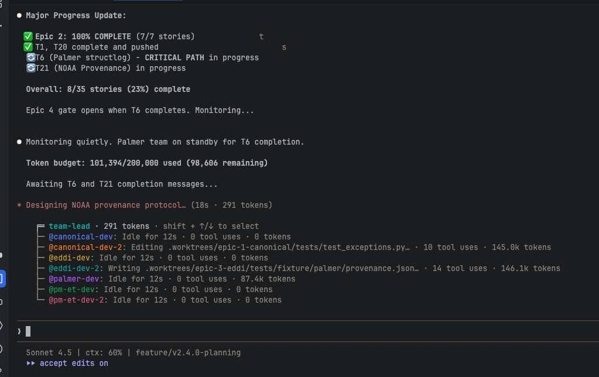

# Spec-Driven Development with Orchestrated Agent Teams

## The Core Problem

AI coding agents are capable but stateless. Each session starts fresh. Without persistent, structured context, agents make locally reasonable decisions that contradict decisions made in other sessions or by other agents. At scale — multiple epics, multiple parallel workers, a brownfield codebase — this becomes the primary failure mode, not capability. Session A chooses one exception naming pattern. Session B doesn't know about Session A and chooses a different one. The codebase accumulates contradictions, and the reasoning behind each choice evaporates when the conversation ends.

## The BMAD Approach: Phases and Artifacts

BMAD (Build More Architect Dreams) solves this with a phased workflow where each phase produces an artifact that constrains what comes next. The artifacts live in the repository. The git history is the audit trail. No agent needs to remember anything — it reads the spec.

| Phase | Artifact | What It Constrains |
|-------|----------|--------------------|
| **Discover** | Project brief | Scopes the problem space; prevents agents from solving the wrong problem |
| **Plan** | PRD + architecture doc | The PRD says *what* to build; the architecture says *how*; both are committed to the repo and become the shared context for all agents |
| **Solutionize** | Epics and stories | Written *after* architecture (a key v6 improvement), so every story reflects actual technical constraints — not aspirational ones |
| **Build** | One story per agent session | The session reads the story and the architecture doc; nothing else needs to be remembered |

The artifacts are not documentation overhead. They are the communication protocol between human intent and agent execution — and between parallel agents that must not contradict each other.

## From Sequential to Parallel: Claude Code Agent Teams

Without parallel execution, each story runs sequentially, the human supervises each session, and throughput is bounded by human attention. With Claude Code's agent teams feature, a team-lead session orchestrates named specialist agents, each working in an isolated git worktree on a specific epic.

The architecture document is what makes this safe. It is the shared context that prevents parallel agents from making conflicting technical decisions. Epic gates enforce sequencing where true dependencies exist. Stories designed with explicit dependency mapping unlock maximum concurrency.

Here is a live capture of the team-lead orchestrating four epic tracks in parallel:

What the screenshot shows: a team-lead orchestrator managing seven named specialist agents. `@canonical-dev-2` (145k tokens) is implementing Palmer structured logging on the critical path. `@eddi-dev-2` (146k tokens) is writing NOAA provenance metadata in a separate track — no shared dependencies, so it runs concurrently. `@palmer-dev` (87k tokens) sits idle, blocked by a dependency gate: Epic 4 cannot begin until the Palmer structlog migration completes. The team-lead enforces this automatically. Token budget tracking (101k/200k used), standby queues, and critical path monitoring are visible — the orchestration is real infrastructure, not a metaphor.

## What This Produced

This approach was applied iteratively over roughly three weeks to `climate_indices`, a 7-year-old, 385-star Python library used at NOAA for drought monitoring. The domain does not matter for this discussion. The scale and quality do: three BMAD iterations produced 35 stories across four parallel epics, executed by multiple concurrent agent teams. New capabilities included a full xarray API layer, new drought indices, structured logging, and parallel computation support — with zero breaking changes to the public API. A five-year-old dormant GitHub issue was closed in three days.

The test suite nearly tripled (250 to 703 tests). A committed retrospective documents what worked, what failed (a dev agent pattern-matched to existing code instead of reading the spec — the spec is ground truth), and the 282:1 file reduction ratio when exploratory agent work was distilled into clean, reviewable pull requests.

## Companion Material

The companion documents in this collection cover the xarray adapter architecture, the EDDI retrospective, the parallel agent team orchestration in detail, and step-by-step terminal walkthroughs of the key moments. They are available in both 10-minute and 20-minute formats. We can go as deep as time permits.

---

### Quick Reference

| Dimension | Detail |
|-----------|--------|
| **Methodology** | BMAD v6 (Build More Architect Dreams) |
| **Phases** | Discover, Plan, Solutionize, Build |
| **Agent orchestration** | Claude Code agent teams with named specialists |
| **Isolation** | One git worktree per epic; architecture doc as shared context |
| **Scale applied** | 35 stories, 4 epics, 4 concurrent agent teams |
| **Codebase** | `climate_indices` — Python, NumPy/xarray/scipy, 14 modules |
| **Results** | Zero breaking changes; test count 250 → 703; 5-year issue closed in 3 days |
| **Exploration ratio** | 282:1 (845 files explored → 3 files shipped) |
